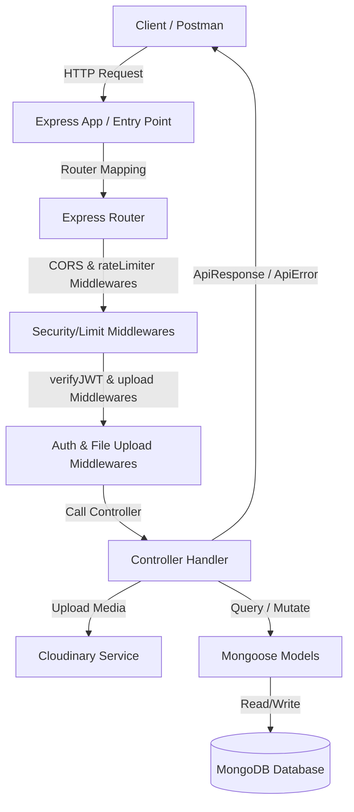

<div align="center">

# 🎬 Video Hosting Backend API

### The Backend Powerhouse of a Full-Stack MERN Video Platform

[](https://nodejs.org/)
[](https://expressjs.com/)
[](https://www.mongodb.com/)
[](https://jwt.io/)
[](https://cloudinary.com/)
[](./LICENSE)

> A production-grade, scalable **REST API** built with the **MERN Stack** (MongoDB · Express · React · Node.js) to power a YouTube-like video hosting platform — featuring JWT auth, Cloudinary media management, aggregation pipelines, and more.

**Author:** Mohammad Asfin &nbsp;|&nbsp; **Stack:** MERN &nbsp;|&nbsp; **License:** MIT &nbsp;|&nbsp; **Version:** 1.0.0

[🚀 Quick Start](#️-installation--setup) · [📬 API Docs](#-api-endpoints) · [🤝 Contributing](./CONTRIBUTING.md) · [🐛 Report Bug](https://github.com/Mohammad-Asfin/Video-Hosting-Backend-API/issues) · [💡 Request Feature](https://github.com/Mohammad-Asfin/Video-Hosting-Backend-API/issues)

</div>

---

## 📌 Project Overview

This is the **backend (M·E·N layer)** of a full-stack **MERN** video hosting web application — similar to YouTube. It exposes a complete REST API consumed by a React frontend, handling everything from user authentication to video streaming metadata, social interactions, and cloud media management.

> 🧩 **MERN Stack Breakdown:**
>
> | Layer | Technology                            | Role               |
> | ----- | ------------------------------------- | ------------------ |
> | **M** | MongoDB + Mongoose                    | Database & ODM     |
> | **E** | Express.js                            | REST API Framework |
> | **R** | React.js _(Frontend — separate repo)_ | Client-side UI     |
> | **N** | Node.js                               | JavaScript Runtime |

---

## ✨ Key Features

- 🔐 **JWT Authentication** — Stateless access & refresh token strategy
- 🔑 **Password Security** — bcrypt hashing (never stored as plain text)
- 📹 **Video Uploads** — Cloud media handling via Cloudinary + Multer
- 💬 **Threaded Comments** — Nested reply system for video comments
- 👍 **Likes / Dislikes** — On videos, comments, and tweets
- 📋 **Playlists** — Create, update, and manage video playlists
- 🔔 **Subscriptions** — Channel subscribe / unsubscribe with counts
- 📊 **Dashboard** — Channel analytics (views, subscribers, videos, likes)
- 🐦 **Tweets & Polls** — Short-form posts with optional images or interactive polls
- 🔔 **Real-Time Notifications** — Event-driven user alerts powered by Socket.io
- 🛡️ **Report System** — Flag inappropriate content (videos, comments, tweets, or users)
- 🩺 **Health Check** — `/healthcheck` endpoint for uptime monitoring
- 🚀 **Rate Limiting** — DDoS protection & spam prevention for endpoints
- 🌐 **CORS** — Fully configurable cross-origin resource sharing
- 📄 **Pagination** — MongoDB aggregation pipeline pagination
- 🧹 **Code Quality** — Prettier enforced across the codebase

---

## 🗂️ Project Structure

```
📦 Video-Hosting-Backend-API
├── 📁 public/
│   └── 📁 temp/                  # Temporary local file storage
├── 📁 src/
│   ├── 📁 controllers/           # Route handlers & business logic
│   │   ├── comment.controller.js
│   │   ├── dashboard.controller.js
│   │   ├── healthcheck.controller.js
│   │   ├── like.controller.js
│   │   ├── notification.controller.js
│   │   ├── playlist.controller.js
│   │   ├── report.controller.js
│   │   ├── subscription.controller.js
│   │   ├── tweet.controller.js
│   │   ├── user.controller.js
│   │   └── video.controller.js
│   ├── 📁 db/
│   │   └── index.js              # MongoDB connection setup
│   ├── 📁 middlewares/
│   │   ├── auth.middleware.js    # JWT verification middleware
│   │   ├── multer.middleware.js  # File upload middleware
│   │   └── rateLimiter.js        # API rate-limiting middleware
│   ├── 📁 models/                # Mongoose schemas & models
│   │   ├── comment.model.js
│   │   ├── like.model.js
│   │   ├── notification.model.js
│   │   ├── playlist.model.js
│   │   ├── report.model.js
│   │   ├── subscription.model.js
│   │   ├── tweet.model.js
│   │   ├── user.model.js
│   │   ├── video.model.js
│   │   └── view.model.js
│   ├── 📁 routes/                # Express route definitions
│   │   ├── comment.routes.js
│   │   ├── dashboard.routes.js
│   │   ├── healthcheck.routes.js
│   │   ├── like.routes.js
│   │   ├── notification.routes.js
│   │   ├── playlist.routes.js
│   │   ├── report.routes.js
│   │   ├── subscription.routes.js
│   │   ├── tweet.routes.js
│   │   ├── user.routes.js
│   │   └── video.routes.js
│   ├── 📁 utils/                 # Reusable utility helpers
│   │   ├── ApiError.js           # Custom error class
│   │   ├── ApiResponse.js        # Standardised API response
│   │   ├── asyncHandler.js       # Async error wrapper
│   │   └── cloudinary.js         # Cloudinary upload helper
│   ├── app.js                    # Express app & middleware setup
│   ├── constants.js              # App-wide constants (DB name, etc.)
│   ├── index.js                  # Server entry point
│   └── socket.js                 # Real-time WebSocket connection setup
├── .env.sample                   # Environment variable template
├── .gitignore
├── .prettierrc
├── .prettierignore
├── CONTRIBUTING.md
├── LICENSE
├── package.json
└── Readme.md
```

---

## 📐 Data Model (ER Diagram)

🔗 [View Full ER Diagram on Eraser.io](https://app.eraser.io/workspace/YtPqZ1VogxGy1jzIDkzj?origin=share)

---

## 🔍 Understanding MongoDB Aggregation Pipelines

In this project, we extensively use **MongoDB Aggregation Pipelines** to perform complex data retrieval and transformation operations directly within the database.

### What is an Aggregation Pipeline?

An aggregation pipeline consists of one or more "stages" that process documents. Each stage performs an operation on the input documents (e.g., filtering, grouping, calculating, or joining data) and passes the transformed documents to the next stage. It's highly efficient because the heavy processing happens on the database server rather than in the Node.js backend.

### Key Operators Used in this Project

Here are some of the most critical aggregation operators (`$`) we utilize, especially in controllers like `getUserChannelProfile` and `getWatchHistory`:

- **`$match`**: Acts like a standard query filter. It filters the document stream to allow only matching documents to pass into the next pipeline stage. We often use this as the very first stage to narrow down the dataset (e.g., finding a user by their `username` or `_id`).
- **`$lookup`**: Performs a "left outer join" with another collection. This is crucial for a relational-like data structure in NoSQL. For example, when fetching a video, we use `$lookup` to join the `users` collection to get the video owner's avatar and username. We also use it to fetch a channel's subscribers from the `subscriptions` collection.
- **`$addFields`**: Adds new fields to documents or overwrites existing ones. We use this to compute new properties on the fly. For instance, calculating `subscribersCount` by finding the length of the joined array.
- **`$size`**: Returns the number of elements in an array. Commonly used alongside `$addFields` to count things like total likes, total videos, or total subscribers.
- **`$cond`**: A ternary operator that evaluates a boolean condition and returns one of two values depending on the result (if-then-else logic). We use this to determine if the currently logged-in user is subscribed to a channel (e.g., checking if `req.user._id` exists in the subscribers list and returning `true` or `false`).
- **`$project`**: Reshapes each document in the stream. It can include, exclude, or add new fields. We use `$project` at the end of our pipelines to clean up the data and ensure we only send the necessary fields to the frontend, stripping out unnecessary nested arrays or sensitive data.

---

## 🛠️ Tech Stack

| Technology                         | Version | Purpose                             |
| ---------------------------------- | ------- | ----------------------------------- |
| **Node.js**                        | 18+     | JavaScript runtime                  |
| **Express.js**                     | ^4.x    | REST API framework                  |
| **Socket.io**                      | ^4.x    | Real-time WebSocket connection      |
| **MongoDB**                        | Atlas   | NoSQL document database             |
| **Mongoose**                       | ^8.x    | MongoDB ODM                         |
| **mongoose-aggregate-paginate-v2** | ^1.x    | Aggregation pagination plugin       |
| **jsonwebtoken**                   | ^9.x    | JWT access & refresh tokens         |
| **bcrypt**                         | ^5.x    | Secure password hashing             |
| **express-rate-limit**             | ^8.x    | API rate limiting / DDoS protection |
| **Cloudinary**                     | ^1.x    | Cloud media upload & management     |
| **Multer**                         | ^1.x    | Multipart file upload middleware    |
| **dotenv**                         | ^16.x   | Environment variable loader         |
| **cookie-parser**                  | ^1.x    | HTTP cookie parsing                 |
| **cors**                           | ^2.x    | Cross-Origin Resource Sharing       |
| **nodemon** _(dev)_                | ^3.x    | Auto-restart on file changes        |
| **Prettier** _(dev)_               | ^3.x    | Opinionated code formatter          |

---

## ⚙️ Installation & Setup

### Prerequisites

Ensure the following are installed before proceeding:

- ✅ [Node.js](https://nodejs.org/) v18+
- ✅ [Git](https://git-scm.com/)
- ✅ [MongoDB Atlas](https://www.mongodb.com/cloud/atlas) account
- ✅ [Cloudinary](https://cloudinary.com/) account

---

### 1. Clone the Repository

```bash
git clone https://github.com/Mohammad-Asfin/Video-Hosting-Backend-API.git
cd Video-Hosting-Backend-API
```

---

### 2. Install All Dependencies

**Individual packages (with descriptions):**

```bash
# Dev — Auto-restart on file changes
npm i -D nodemon

# Dev — Opinionated code formatter
npm i -D prettier

# MongoDB object modeling (ODM)
npm i mongoose

# Fast, minimalist web framework for Node.js
npm i express

# Load environment variables from .env file
npm i dotenv

# HTTP cookie parsing middleware
npm i cookie-parser

# Node.js CORS middleware for Express
npm i cors

# Mongoose aggregation pipeline pagination plugin
npm i mongoose-aggregate-paginate-v2

# Secure password hashing library
npm i bcrypt

# JSON Web Token implementation
npm i jsonwebtoken

# Cloudinary Node SDK — media upload & transformation
npm i cloudinary

# Multipart/form-data middleware (file uploads)
npm i multer

# Real-time WebSocket support for Node.js
npm i socket.io

# Basic rate-limiting middleware for Express
npm i express-rate-limit
```

**Or install everything at once:**

```bash
npm install
```

---

### 3. Configure Environment Variables

```bash
cp .env.sample .env
```

Open `.env` and fill in your values:

```env
PORT=8000
MONGODB_URI=mongodb+srv://<username>:<password>@cluster0.xxxxx.mongodb.net

CORS_ORIGIN=*

# ⚠️ Use DIFFERENT secrets for access and refresh tokens
# Generate with: node -e "console.log(require('crypto').randomBytes(64).toString('hex'))"
ACCESS_TOKEN_SECRET=<your_64_byte_hex_secret_here>
ACCESS_TOKEN_EXPIRY=1d

REFRESH_TOKEN_SECRET=<your_different_64_byte_hex_secret_here>
REFRESH_TOKEN_EXPIRY=10d

# Cloudinary (https://cloudinary.com/console)
CLOUDINARY_CLOUD_NAME=<your_cloud_name>
CLOUDINARY_API_KEY=<your_api_key>
CLOUDINARY_API_SECRET=<your_api_secret>
```

**Generate secure secrets:**

```bash
node -e "console.log(require('crypto').randomBytes(64).toString('hex'))"
```

Run this command **twice** — use one output for `ACCESS_TOKEN_SECRET` and a different one for `REFRESH_TOKEN_SECRET`.

> ⚠️ **Security Rules:**
>
> - Never use the same secret for both tokens
> - Use at least 64 random bytes (128 hex characters)
> - **NEVER commit `.env` to GitHub** — it's already in `.gitignore`

---

### 4. Run the Server

```bash
# Development (nodemon auto-restarts on changes)
npm run dev
```

Server running at → **`http://localhost:8000`**

---

## 📬 API Endpoints

### Base URL

```
http://localhost:8000/api/v1
```

### 👤 User — `/api/v1/users`

| Method  | Endpoint           | Description                | Auth |
| ------- | ------------------ | -------------------------- | :--: |
| `POST`  | `/register`        | Register a new user        |  ❌  |
| `POST`  | `/login`           | Login & receive tokens     |  ❌  |
| `POST`  | `/logout`          | Logout current user        |  ✅  |
| `POST`  | `/refresh-token`   | Refresh access token       |  ❌  |
| `PATCH` | `/change-password` | Change current password    |  ✅  |
| `GET`   | `/current-user`    | Get logged-in user profile |  ✅  |
| `PATCH` | `/update-account`  | Update name & email        |  ✅  |
| `PATCH` | `/avatar`          | Upload new avatar          |  ✅  |
| `PATCH` | `/cover-image`     | Upload new cover image     |  ✅  |
| `GET`   | `/c/:username`     | Get channel profile        |  ✅  |
| `GET`   | `/history`         | Get watch history          |  ✅  |

### 🎥 Video — `/api/v1/videos`

| Method   | Endpoint                   | Description           | Auth |
| -------- | -------------------------- | --------------------- | :--: |
| `GET`    | `/`                        | Get all videos        |  ❌  |
| `POST`   | `/`                        | Publish a video       |  ✅  |
| `GET`    | `/:videoId`                | Get video by ID       |  ✅  |
| `PATCH`  | `/:videoId`                | Update video details  |  ✅  |
| `DELETE` | `/:videoId`                | Delete a video        |  ✅  |
| `PATCH`  | `/toggle/publish/:videoId` | Toggle publish status |  ✅  |

### 💬 Comment — `/api/v1/comments`

| Method   | Endpoint                | Description                                                      | Auth |
| -------- | ----------------------- | ---------------------------------------------------------------- | :--: |
| `GET`    | `/:videoId`             | Get all comments for a video                                     |  ✅  |
| `POST`   | `/:videoId`             | Add a comment to a video (supports rate limit)                   |  ✅  |
| `PATCH`  | `/c/:commentId`         | Update a comment                                                 |  ✅  |
| `DELETE` | `/c/:commentId`         | Delete a comment                                                 |  ✅  |
| `GET`    | `/c/:commentId/replies` | Get nested replies for a comment                                 |  ✅  |

### 👍 Like — `/api/v1/likes`

| Method | Endpoint               | Description            | Auth |
| ------ | ---------------------- | ---------------------- | :--: |
| `POST` | `/toggle/v/:videoId`   | Toggle like on video   |  ✅  |
| `POST` | `/toggle/c/:commentId` | Toggle like on comment |  ✅  |
| `POST` | `/toggle/t/:tweetId`   | Toggle like on tweet   |  ✅  |
| `GET`  | `/videos`              | Get all liked videos   |  ✅  |

### 📋 Playlist — `/api/v1/playlist`

| Method   | Endpoint                       | Description                | Auth |
| -------- | ------------------------------ | -------------------------- | :--: |
| `POST`   | `/`                            | Create a playlist          |  ✅  |
| `GET`    | `/user/:userId`                | Get user playlists         |  ✅  |
| `GET`    | `/:playlistId`                 | Get playlist by ID         |  ✅  |
| `PATCH`  | `/:playlistId`                 | Update playlist            |  ✅  |
| `DELETE` | `/:playlistId`                 | Delete playlist            |  ✅  |
| `PATCH`  | `/add/:videoId/:playlistId`    | Add video to playlist      |  ✅  |
| `PATCH`  | `/remove/:videoId/:playlistId` | Remove video from playlist |  ✅  |

### 🔔 Subscription — `/api/v1/subscriptions`

| Method | Endpoint           | Description             | Auth |
| ------ | ------------------ | ----------------------- | :--: |
| `POST` | `/c/:channelId`    | Toggle subscription     |  ✅  |
| `GET`  | `/c/:channelId`    | Get channel subscribers |  ✅  |
| `GET`  | `/u/:subscriberId` | Get subscribed channels |  ✅  |

### 🐦 Tweet — `/api/v1/tweets`

| Method   | Endpoint         | Description                                                              | Auth |
| -------- | ---------------- | ------------------------------------------------------------------------ | :--: |
| `POST`   | `/`              | Create tweet (supports content + optional image + optional poll options) |  ✅  |
| `GET`    | `/user/:userId`  | Get user tweets                                                          |  ✅  |
| `PATCH`  | `/:tweetId`      | Update tweet                                                             |  ✅  |
| `DELETE` | `/:tweetId`      | Delete tweet                                                             |  ✅  |
| `PATCH`  | `/:tweetId/vote` | Vote on a poll option                                                    |  ✅  |

### 🔔 Notification — `/api/v1/notifications`

| Method  | Endpoint                | Description                              | Auth |
| ------- | ----------------------- | ---------------------------------------- | :--: |
| `GET`   | `/`                     | Get all notifications for logged-in user |  ✅  |
| `PATCH` | `/:notificationId/read` | Mark a notification as read              |  ✅  |

### 🚩 Report — `/api/v1/reports`

| Method  | Endpoint     | Description                            | Auth |
| ------- | ------------ | -------------------------------------- | :--: |
| `POST`  | `/`          | Create/submit a content report         |  ✅  |
| `GET`   | `/`          | Get all reports (Admin/Moderator view) |  ✅  |
| `PATCH` | `/:reportId` | Resolve or dismiss a report            |  ✅  |

### 📊 Dashboard — `/api/v1/dashboard`

| Method | Endpoint  | Description        | Auth |
| ------ | --------- | ------------------ | :--: |
| `GET`  | `/stats`  | Get channel stats  |  ✅  |
| `GET`  | `/videos` | Get channel videos |  ✅  |

### 🩺 Health Check — `/api/v1/healthcheck`

| Method | Endpoint | Description      | Auth |
| ------ | -------- | ---------------- | :--: |
| `GET`  | `/`      | Check API health |  ❌  |

---

##  Testing with Postman & Data Flow

This API relies on **MongoDB Atlas** for database storage and **Cloudinary** for media management. Here is a standard flow for testing authentication and media uploads using **Postman**:

> 💡 **Postman Tip:** To make testing easier, set up a Collection Variable named `Video Hosting` with the value `http://localhost:8000/api/v1`. You can then use `{{Video Hosting}}` in your URLs.

### 1️⃣ Register a New User (Uploads to Cloudinary & MongoDB)

- **Method**: `POST`
- **URL**: `{{Video Hosting}}/users/register`
- **Body Type**: `form-data`

| Key          | Type | Example Value   | Description                          |
| ------------ | ---- | --------------- | ------------------------------------ |
| `fullName`   | Text | `Levi Ackerman` | User's full name                     |
| `username`   | Text | `leviackerman`  | Unique username                      |
| `email`      | Text | `levi@aot.com`  | User's email                         |
| `password`   | Text | `12345678`      | Secure password                      |
| `avatar`     | File | `Levi.jpg`      | **Required.** Uploads to Cloudinary. |
| `coverImage` | File | `AOT cover.jpg` | **Optional.** Uploads to Cloudinary. |

> 🔄 **Data Flow:**
>
> - **Cloudinary:** The `avatar` and `coverImage` files are processed by Multer and successfully uploaded to your Cloudinary Media Library. The secure URLs are returned.
> - **MongoDB Atlas:** A new document is created in the `users` collection within your `videotube` database, securely storing the hashed password and the Cloudinary image URLs.

**Expected response:** `201 Created`

---

### 2️⃣ Login User (Generates JWT Tokens)

- **Method**: `POST`
- **URL**: `{{Video Hosting}}/users/login`
- **Body Type**: `raw` (JSON)

```json
{
  "email": "levi@aot.com",
  "password": "12345678"
}
```

**Expected Response:** `200 OK`
The server validates the credentials and returns an `accessToken` (for authorizing requests) and a `refreshToken` (for getting new access tokens). These tokens are also securely set in HttpOnly cookies.

---

### 3️⃣ Get Current User

- **Method**: `GET`
- **URL**: `{{Video Hosting}}/users/current-user`
- **Headers**: Requires the user to be logged in (cookies set by login).
- **Body**: None

**Expected Response:** `200 OK`

```json
{
  "statusCode": 200,
  "data": {
    "_id": "6a5cb07f4822053c999663b8",
    "username": "leviackerman",
    "email": "levi@aot.com",
    "fullName": "Levi Ackerman",
    "avatar": "http://res.cloudinary.com/...",
    "coverImage": "http://res.cloudinary.com/...",
    "watchHistory": [],
    "createdAt": "2026-07-19T11:09:51.446Z",
    "updatedAt": "2026-07-21T09:09:51.918Z",
    "__v": 0
  },
  "message": "User fetched successfully",
  "success": true
}
```

---

### 4️⃣ Get User Channel Profile

- **Method**: `GET`
- **URL**: `{{Video Hosting}}/users/c/leviackerman`
- **Headers**: Requires the user to be logged in (cookies set by login).
- **Body**: None

**Expected Response:** `200 OK`

```json
{
  "statusCode": 200,
  "data": {
    "_id": "6a5cb07f4822053c999663b8",
    "username": "leviackerman",
    "email": "levi@aot.com",
    "fullName": "Levi Ackerman",
    "avatar": "http://res.cloudinary.com/...",
    "coverImage": "http://res.cloudinary.com/...",
    "subscribersCount": 0,
    "channelsSubscribedToCount": 0,
    "isSubscribed": false
  },
  "message": "User channel fetched successfully",
  "success": true
}
```

---

### 5️⃣ Get Watch History

- **Method**: `GET`
- **URL**: `{{Video Hosting}}/users/history`
- **Headers**: Requires the user to be logged in (cookies set by login).
- **Body**: None

**Expected Response:** `200 OK`

```json
{
  "statusCode": 200,
  "data": [],
  "message": "Watch history fetched successfully",
  "success": true
}
```

---

### 6️⃣ Change Password

- **Method**: `POST`
- **URL**: `{{Video Hosting}}/users/change-password`
- **Headers**: Requires the user to be logged in (cookies set by login).
- **Body Type**: `raw` (JSON)

```json
{
  "oldPassword": "123456789",
  "newPassword": "12345678"
}
```

**Expected Response:** `200 OK`

```json
{
  "statusCode": 200,
  "data": {},
  "message": "Password changed successfully",
  "success": true
}
```

---

### 7️⃣ Refresh Token

- **Method**: `POST`
- **URL**: `{{Video Hosting}}/users/refresh-token`
- **Headers**: Requires the refresh token cookie.
- **Body**: None

**Expected Response:** `200 OK`

```json
{
  "statusCode": 200,
  "data": {
    "accessToken": "eyJhbGciOiJIUzI1NiIsInR5cCI6IkpXVCJ9..."
  },
  "message": "Access token refreshed",
  "success": true
}
```

---

### 8️⃣ Logout User (Clears Tokens)

- **Method**: `POST`
- **URL**: `{{Video Hosting}}/users/logout`
- **Headers**: Requires the user to be logged in (cookies set by login).
- **Body**: None

**Expected Response:** `200 OK`

```json
{
  "statusCode": 200,
  "data": {},
  "message": "User logged Out",
  "success": true
}
```

---

### 9️⃣ Publish a Video (Cloudinary Upload)

- **Method**: `POST`
- **URL**: `{{Video Hosting}}/videos`
- **Headers**: Requires the user to be logged in (cookies set by login).
- **Body Type**: `form-data`

| Key           | Type | Example Value      | Description                          |
| ------------- | ---- | ------------------ | ------------------------------------ |
| `title`       | Text | `My First Vlog`    | Video title                          |
| `description` | Text | `A day in my life` | Video description                    |
| `videoFile`   | File | `vlog.mp4`         | **Required.** Uploads to Cloudinary. |
| `thumbnail`   | File | `thumbnail.jpg`    | **Required.** Uploads to Cloudinary. |

**Expected Response:** `201 Created`

```json
{
  "statusCode": 201,
  "data": {
    "videoFile": "http://res.cloudinary.com/...",
    "thumbnail": "http://res.cloudinary.com/...",
    "title": "My First Vlog",
    "description": "A day in my life"
  },
  "message": "Video published successfully",
  "success": true
}
```

---

### 🔟 Post a Comment

- **Method**: `POST`
- **URL**: `{{Video Hosting}}/comments/:videoId`
- **Headers**: Requires the user to be logged in.
- **Body Type**: `raw` (JSON)

```json
{
  "content": "This is an amazing video!"
}
```

**Expected Response:** `201 Created`

---

### 1️⃣1️⃣ Toggle a Like (Video/Comment/Tweet)

- **Method**: `POST`
- **URL**: `{{Video Hosting}}/likes/toggle/v/:videoId` _(Replace `/v/` with `/c/` or `/t/` for comments/tweets)_
- **Headers**: Requires the user to be logged in.
- **Body**: None

**Expected Response:** `200 OK`

```json
{
  "statusCode": 200,
  "data": {
    "liked": true
  },
  "message": "Like added to video",
  "success": true
}
```

---

### 1️⃣2️⃣ Create a Playlist

- **Method**: `POST`
- **URL**: `{{Video Hosting}}/playlist`
- **Headers**: Requires the user to be logged in.
- **Body Type**: `raw` (JSON)

```json
{
  "name": "React Tutorials",
  "description": "Best tutorials to learn React.js"
}
```

**Expected Response:** `201 Created`

---

### 1️⃣3️⃣ Toggle Channel Subscription

- **Method**: `POST`
- **URL**: `{{Video Hosting}}/subscriptions/c/:channelId`
- **Headers**: Requires the user to be logged in.
- **Body**: None

**Expected Response:** `200 OK`

```json
{
  "statusCode": 200,
  "data": {
    "subscribed": true
  },
  "message": "Subscribed successfully",
  "success": true
}
```

---

### 1️⃣4️⃣ Create a Tweet

- **Method**: `POST`
- **URL**: `{{Video Hosting}}/tweets`
- **Headers**: Requires the user to be logged in.
- **Body Type**: `raw` (JSON)

```json
{
  "content": "Just launched my new channel!"
}
```

**Expected Response:** `201 Created`

---

### 1️⃣5️⃣ Get Channel Dashboard Stats

- **Method**: `GET`
- **URL**: `{{Video Hosting}}/dashboard/stats`
- **Headers**: Requires the user to be logged in.
- **Body**: None

**Expected Response:** `200 OK`

```json
{
  "statusCode": 200,
  "data": {
    "totalSubscribers": 1500,
    "totalVideos": 25,
    "totalViews": 50000,
    "totalLikes": 1200
  },
  "message": "Channel stats fetched successfully",
  "success": true
}
```

---

### 1️⃣6️⃣ API Health Check

- **Method**: `GET`
- **URL**: `{{Video Hosting}}/healthcheck`
- **Body**: None

**Expected Response:** `200 OK`

```json
{
  "statusCode": 200,
  "data": {},
  "message": "OK",
  "success": true
}
```

---

### 1️⃣7️⃣ Fetching All Videos (Home Feed)

- **Method**: `GET`
- **URL**: `{{Video Hosting}}/videos?page=1&limit=10&sortBy=createdAt&sortType=desc`
- **Body**: None

**Expected Response:** `200 OK`

```json
{
  "statusCode": 200,
  "data": {
    "docs": [
      {
        "_id": "6a604e404b74605254976f7d",
        "videoFile": "http://res.cloudinary.com/...",
        "thumbnail": "http://res.cloudinary.com/...",
        "title": "My First Vlog",
        "description": "A day in my life",
        "duration": 19.64,
        "views": 0,
        "isPublished": true,
        "owner": {
          "_id": "6a5cb07f4822053c999663b8",
          "username": "leviackerman",
          "avatar": "http://res.cloudinary.com/..."
        }
      }
    ],
    "totalDocs": 1,
    "limit": 10,
    "page": 1,
    "totalPages": 1,
    "pagingCounter": 1,
    "hasPrevPage": false,
    "hasNextPage": false,
    "prevPage": null,
    "nextPage": null
  },
  "message": "Videos fetched successfully",
  "success": true
}
```

---

### 1️⃣8️⃣ Watching a Video (Fetch by ID)

- **Method**: `GET`
- **URL**: `{{Video Hosting}}/videos/:videoId`
- **Headers**: Requires the user to be logged in (to add to history).
- **Body**: None

**Expected Response:** `200 OK`

```json
{
  "statusCode": 200,
  "data": {
    "_id": "6a604e404b74605254976f7d",
    "videoFile": "http://res.cloudinary.com/...",
    "thumbnail": "http://res.cloudinary.com/...",
    "title": "My First Vlog",
    "description": "A day in my life",
    "duration": 19.64,
    "views": 1,
    "isPublished": true,
    "owner": {
      "_id": "6a5cb07f4822053c999663b8",
      "username": "leviackerman",
      "avatar": "http://res.cloudinary.com/..."
    },
    "likesCount": 10,
    "isLiked": true
  },
  "message": "Video fetched successfully",
  "success": true
}
```

---

### 1️⃣9️⃣ Updating User Avatar

- **Method**: `PATCH`
- **URL**: `{{Video Hosting}}/users/avatar`
- **Headers**: Requires the user to be logged in.
- **Body Type**: `form-data`

| Key      | Type | Example Value    | Description                          |
| -------- | ---- | ---------------- | ------------------------------------ |
| `avatar` | File | `new_avatar.jpg` | **Required.** Uploads to Cloudinary. |

**Expected Response:** `200 OK`

```json
{
  "statusCode": 200,
  "data": {
    "_id": "6a5cb07f4822053c999663b8",
    "username": "leviackerman",
    "avatar": "http://res.cloudinary.com/.../new_avatar.jpg",
    "coverImage": "http://res.cloudinary.com/..."
  },
  "message": "Avatar image updated successfully",
  "success": true
}
```

---

### 2️⃣0️⃣ Adding a Video to a Playlist

- **Method**: `PATCH`
- **URL**: `{{Video Hosting}}/playlist/add/:videoId/:playlistId`
- **Headers**: Requires the user to be logged in.
- **Body**: None

**Expected Response:** `200 OK`

```json
{
  "statusCode": 200,
  "data": {
    "_id": "6a6053954b74605254976f8e",
    "name": "React Tutorials",
    "videos": ["6a604e404b74605254976f7d"]
  },
  "message": "Video added to playlist successfully",
  "success": true
}
```

---

### 2️⃣1️⃣ Getting Liked Videos

- **Method**: `GET`
- **URL**: `{{Video Hosting}}/likes/videos`
- **Headers**: Requires the user to be logged in.
- **Body**: None

**Expected Response:** `200 OK`

```json
{
  "statusCode": 200,
  "data": [
    {
      "_id": "6a6057c74b74605254976f9d",
      "video": {
        "_id": "6a604e404b74605254976f7d",
        "videoFile": "http://res.cloudinary.com/...",
        "thumbnail": "http://res.cloudinary.com/...",
        "title": "My First Vlog",
        "duration": 19.64,
        "views": 1,
        "ownerDetails": {
          "username": "leviackerman",
          "avatar": "http://res.cloudinary.com/..."
        }
      }
    }
  ],
  "message": "Liked videos fetched successfully",
  "success": true
}
```

---

## 🧪 Testing with Postman

To test this API locally or in production using Postman, follow these configuration guidelines:

### 1. Set Up Environment Variables
Create a new Postman environment and define the following variables:
- `base_url`: `http://localhost:8000/api/v1`

### 2. Managing Authentication (JWT)
The API uses HTTP-only cookies (`accessToken` and `refreshToken`) for authentication:
- **Automatic Handling**: Postman handles cookies automatically. When you send a successful `POST /users/login` request, the server returns the tokens in the `Set-Cookie` header. Subsequent requests will include them automatically.
- **Manual Header Handling**: If you prefer to pass tokens via headers, you can manually set the `Authorization` header on protected endpoints:
  - Header: `Authorization`
  - Value: `Bearer <your_access_token>`

### 3. File Uploads (Multipart Form Data)
For endpoints requiring file uploads (e.g., `POST /users/register` or `POST /videos/`):
- Change the body type in Postman to **form-data**.
- Use the exact field names defined in the routes:
  - **User Registration**: `avatar` (File), `coverImage` (File), `username` (Text), `email` (Text), `fullName` (Text), `password` (Text).
  - **Video Upload**: `videoFile` (File), `thumbnail` (File), `title` (Text), `description` (Text).

---

## 🔄 Data Flow Architecture

The diagram below illustrates how an HTTP request flows through the backend application architecture from the client to the database and back:



### Request Pipeline Stages:
1. **Client Request**: The client sends an HTTP request targeting a specific resource route.
2. **Routing & Security**: Express resolves the path. Security/rate limiter middlewares check request frequency and headers.
3. **Authentication & Uploads**: Authentication middlewares (`verifyJWT`) validate tokens. If a file is uploaded, Multer processes the file and attaches it to `req.file` or `req.files`.
4. **Controller Logic**: The controller executes business logic, performs data validation, uploads media to Cloudinary, and queries MongoDB via Mongoose Models.
5. **Response Delivery**: The controller wraps the results in a standardized `ApiResponse` (or forwards errors using `ApiError`) and sends it back to the client.

---


## 📄 npm Scripts

```json
{
  "dev": "nodemon -r dotenv/config --experimental-json-modules src/index.js"
}
```

---

## 🤝 Contributing

We welcome contributions! Please read [CONTRIBUTING.md](./CONTRIBUTING.md) for full guidelines.

**Quick steps:**

1. 🍴 Fork the repository
2. 🌿 Create a branch: `git checkout -b feature/your-feature`
3. ✅ All core **controller TODOs** have been completed! You can add your own features here.
4. 💅 Format code: `npx prettier --write .`
5. 📬 Open a Pull Request against `main`
6. 🔍 After review, your repo link gets added to this README

> Open issues at: [GitHub Issues](https://github.com/Mohammad-Asfin/Video-Hosting-Backend-API/issues)

---

## 🛡️ Security

If you discover a **security vulnerability**, please do **NOT** open a public issue.  
Instead, contact the maintainer directly via GitHub.

- Keep your `.env` file private — **never commit it**
- Rotate JWT secrets regularly in production
- Use environment-specific Cloudinary API keys

---

## 📜 License

This project is licensed under the **MIT License**.  
See the [LICENSE](./LICENSE) file for full details.

```
MIT License — Copyright (c) 2026 Mohammad Asfin
```

---

## 📎 Useful Links

| Resource              | Link                                                                                     |
| --------------------- | ---------------------------------------------------------------------------------------- |
| 🔗 ER Diagram         | [Eraser.io Model](https://app.eraser.io/workspace/YtPqZ1VogxGy1jzIDkzj?origin=share)     |
| 🌐 GitHub Repository  | [Video-Hosting-Backend-API](https://github.com/Mohammad-Asfin/Video-Hosting-Backend-API) |
| 🤝 Contributing Guide | [CONTRIBUTING.md](./CONTRIBUTING.md)                                                     |
| ☁️ Cloudinary         | [cloudinary.com](https://cloudinary.com/)                                                |
| 🍃 MongoDB Atlas      | [mongodb.com/cloud/atlas](https://www.mongodb.com/cloud/atlas)                           |
| 📗 Express Docs       | [expressjs.com](https://expressjs.com/)                                                  |
| 🟢 Node.js            | [nodejs.org](https://nodejs.org/)                                                        |

---

## 👨‍💻 Author

<div align="center">

**Mohammad Asfin**

[](https://github.com/Mohammad-Asfin)

</div>

---

<div align="center">

_Built with ❤️ using the MERN Stack — MongoDB · Express · React · Node.js_

⭐ **Star this repo if you found it helpful!**

</div>
